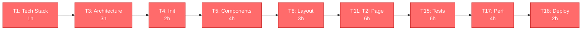
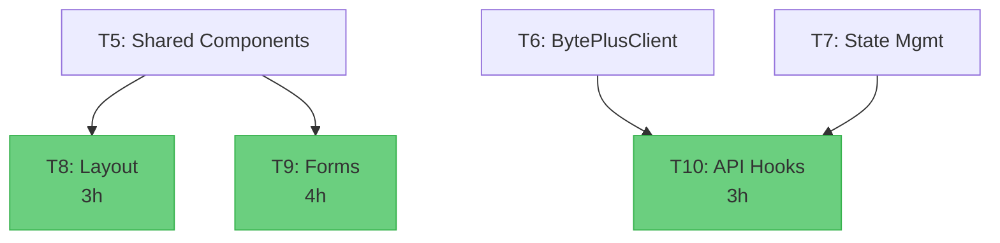
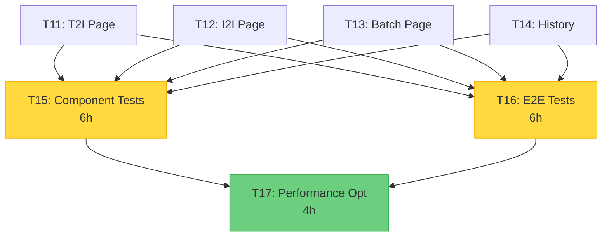
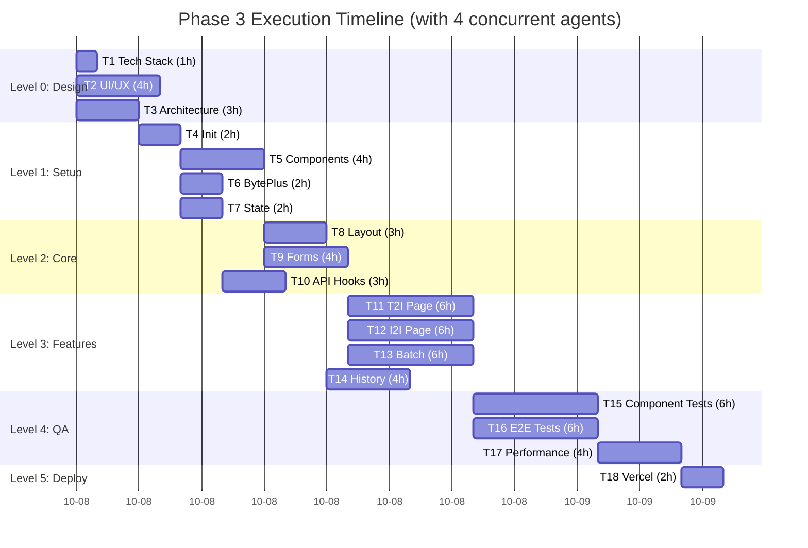

# Phase 3: Task Dependency Graph (DAG)

This document visualizes the complete task dependency graph for Phase 3 UI/UX implementation.

---

## Complete DAG (All Tasks)

```mermaid
graph TD
    %% Level 0: Design Phase
    T1[T1: Tech Stack Setup<br/>1h | Small | CoordinatorAgent]
    T2[T2: UI/UX Design System<br/>4h | Medium | CodeGenAgent]
    T3[T3: Architecture Design<br/>3h | Medium | CodeGenAgent]

    %% Level 1: Setup Phase
    T4[T4: Project Initialization<br/>2h | Medium | CodeGenAgent]
    T5[T5: Shared Components<br/>4h | Medium | CodeGenAgent]
    T6[T6: BytePlusClient Integration<br/>2h | Small | CodeGenAgent]
    T7[T7: State Management Setup<br/>2h | Small | CodeGenAgent]

    %% Level 2: Core Components
    T8[T8: Layout Components<br/>3h | Medium | CodeGenAgent]
    T9[T9: Form Components<br/>4h | Medium | CodeGenAgent]
    T10[T10: API Hooks<br/>3h | Medium | CodeGenAgent]

    %% Level 3: Feature Implementation
    T11[T11: Text-to-Image Page<br/>6h | Large | CodeGenAgent]
    T12[T12: Image-to-Image Page<br/>6h | Large | CodeGenAgent]
    T13[T13: Batch Generation Page<br/>6h | Large | CodeGenAgent]
    T14[T14: History & Settings<br/>4h | Medium | CodeGenAgent]

    %% Level 4: Quality Assurance
    T15[T15: Component Tests<br/>6h | Large | TestAgent]
    T16[T16: E2E Tests<br/>6h | Large | TestAgent]
    T17[T17: Performance Optimization<br/>4h | Medium | CodeGenAgent]

    %% Level 5: Deployment
    T18[T18: Vercel Deployment<br/>2h | Small | DeploymentAgent]

    %% Dependencies
    T1 --> T4
    T3 --> T4

    T2 --> T5
    T4 --> T5
    T4 --> T6
    T4 --> T7

    T5 --> T8
    T5 --> T9
    T6 --> T10
    T7 --> T10

    T8 --> T11
    T9 --> T11
    T10 --> T11

    T8 --> T12
    T9 --> T12
    T10 --> T12

    T8 --> T13
    T9 --> T13
    T10 --> T13

    T8 --> T14
    T7 --> T14

    T11 --> T15
    T12 --> T15
    T13 --> T15
    T14 --> T15

    T11 --> T16
    T12 --> T16
    T13 --> T16
    T14 --> T16

    T15 --> T17
    T16 --> T17

    T17 --> T18

    %% Styling
    classDef critical fill:#ff6b6b,stroke:#c92a2a,color:#fff
    classDef high fill:#ffd93d,stroke:#fab005,color:#000
    classDef medium fill:#6bcf7f,stroke:#37b24d,color:#000
    classDef low fill:#74c0fc,stroke:#339af0,color:#000

    class T1,T4,T18 critical
    class T2,T3,T5,T6,T7,T11,T12,T15,T16 high
    class T8,T9,T10,T13,T14,T17 medium
```

---

## Critical Path (Longest Execution Path)



**Critical Path Duration:** 31 hours

---

## Level-by-Level Breakdown

### Level 0: Design Phase (Parallel: 3 tasks)

```mermaid
graph LR
    T1[T1: Tech Stack Setup<br/>1h | CoordinatorAgent]
    T2[T2: UI/UX Design System<br/>4h | CodeGenAgent]
    T3[T3: Architecture Design<br/>3h | CodeGenAgent]

    style T1 fill:#ffd93d,stroke:#fab005
    style T2 fill:#ffd93d,stroke:#fab005
    style T3 fill:#ffd93d,stroke:#fab005
```

**Duration:** 4 hours (max of parallel tasks)
**Agents Required:** 3

---

### Level 1: Setup Phase

```mermaid
graph TD
    T1[T1: Tech Stack] --> T4[T4: Project Init<br/>2h | CRITICAL]
    T3[T3: Architecture] --> T4

    T4 --> T5[T5: Shared Components<br/>4h]
    T4 --> T6[T6: BytePlusClient<br/>2h]
    T4 --> T7[T7: State Mgmt<br/>2h]

    T2[T2: UI/UX] --> T5

    style T4 fill:#ff6b6b,stroke:#c92a2a,color:#fff
    style T5 fill:#ffd93d,stroke:#fab005
    style T6 fill:#ffd93d,stroke:#fab005
    style T7 fill:#ffd93d,stroke:#fab005
```

**Duration:** 6 hours (2h sequential + 4h parallel)
**Agents Required:** 1 (T4), then 3 (T5, T6, T7)

---

### Level 2: Core Components (Parallel: 3 tasks)



**Duration:** 4 hours (max of parallel tasks)
**Agents Required:** 3

---

### Level 3: Feature Implementation (Parallel: 4 tasks)

```mermaid
graph TD
    T8[T8: Layout] --> T11[T11: Text-to-Image<br/>6h | P1-High]
    T9[T9: Forms] --> T11
    T10[T10: API Hooks] --> T11

    T8 --> T12[T12: Image-to-Image<br/>6h | P1-High]
    T9 --> T12
    T10 --> T12

    T8 --> T13[T13: Batch Generation<br/>6h | P2-Medium]
    T9 --> T13
    T10 --> T13

    T8 --> T14[T14: History & Settings<br/>4h | P3-Low]
    T7[T7: State Mgmt] --> T14

    style T11 fill:#ffd93d,stroke:#fab005
    style T12 fill:#ffd93d,stroke:#fab005
    style T13 fill:#6bcf7f,stroke:#37b24d
    style T14 fill:#74c0fc,stroke:#339af0
```

**Duration:** 6 hours (max of parallel tasks)
**Agents Required:** 4

---

### Level 4: Quality Assurance



**Duration:** 10 hours (6h parallel + 4h sequential)
**Agents Required:** 2 (T15, T16), then 1 (T17)

---

### Level 5: Deployment

```mermaid
graph LR
    T17[T17: Performance Opt] --> T18[T18: Vercel Deploy<br/>2h | CRITICAL]

    style T18 fill:#ff6b6b,stroke:#c92a2a,color:#fff
```

**Duration:** 2 hours
**Agents Required:** 1

---

## Parallel Execution Timeline



---

## Task Dependency Matrix

| Task | Depends On | Blocks |
|------|-----------|--------|
| T1 | - | T4 |
| T2 | - | T5 |
| T3 | - | T4 |
| T4 | T1, T3 | T5, T6, T7 |
| T5 | T2, T4 | T8, T9 |
| T6 | T4 | T10 |
| T7 | T4 | T10, T14 |
| T8 | T5 | T11, T12, T13, T14 |
| T9 | T5 | T11, T12, T13 |
| T10 | T6, T7 | T11, T12, T13 |
| T11 | T8, T9, T10 | T15, T16 |
| T12 | T8, T9, T10 | T15, T16 |
| T13 | T8, T9, T10 | T15, T16 |
| T14 | T8, T7 | T15, T16 |
| T15 | T11, T12, T13, T14 | T17 |
| T16 | T11, T12, T13, T14 | T17 |
| T17 | T15, T16 | T18 |
| T18 | T17 | - |

---

## Concurrency Analysis

### Maximum Parallelism by Level

| Level | Tasks | Max Concurrent | Bottleneck Task |
|-------|-------|----------------|-----------------|
| 0 | 3 | 3 | T2 (4h) |
| 1 | 4 | 3 (after T4) | T5 (4h) |
| 2 | 3 | 3 | T9 (4h) |
| 3 | 4 | 4 | T11, T12, T13 (6h) |
| 4 | 3 | 2 (T17 sequential) | T15, T16 (6h) |
| 5 | 1 | 1 | T18 (2h) |

### Agent Utilization

```mermaid
gantt
    title Agent Utilization (4 Agents)
    dateFormat HH:mm
    axisFormat %H:%M

    section Agent 1
    T1 (1h)    :a1-1, 00:00, 1h
    T4 (2h)    :a1-2, 04:00, 2h
    T5 (4h)    :a1-3, 06:00, 4h
    T8 (3h)    :a1-4, 10:00, 3h
    T11 (6h)   :a1-5, 13:00, 6h
    T15 (6h)   :a1-6, 19:00, 6h
    T17 (4h)   :a1-7, 25:00, 4h
    T18 (2h)   :a1-8, 29:00, 2h

    section Agent 2
    T2 (4h)    :a2-1, 00:00, 4h
    T6 (2h)    :a2-2, 06:00, 2h
    T9 (4h)    :a2-3, 10:00, 4h
    T12 (6h)   :a2-4, 13:00, 6h
    T16 (6h)   :a2-5, 19:00, 6h

    section Agent 3
    T3 (3h)    :a3-1, 00:00, 3h
    T7 (2h)    :a3-2, 06:00, 2h
    T10 (3h)   :a3-3, 10:00, 3h
    T13 (6h)   :a3-4, 13:00, 6h

    section Agent 4
    T14 (4h)   :a4-1, 13:00, 4h
```

---

## Execution Order (Topological Sort)

### Kahn's Algorithm Result

```
Level 0: [T1, T2, T3]
Level 1: [T4] → [T5, T6, T7]
Level 2: [T8, T9, T10]
Level 3: [T11, T12, T13, T14]
Level 4: [T15, T16] → [T17]
Level 5: [T18]
```

### Execution Queue (Breadth-First)

1. Enqueue T1, T2, T3 (no dependencies)
2. Dequeue T1, T2, T3 → Execute in parallel
3. T1, T3 complete → Enqueue T4
4. Dequeue T4 → Execute
5. T2, T4 complete → Enqueue T5
6. T4 complete → Enqueue T6, T7
7. Dequeue T5, T6, T7 → Execute in parallel
8. T5 complete → Enqueue T8, T9
9. T6, T7 complete → Enqueue T10
10. Dequeue T8, T9, T10 → Execute in parallel
11. T8, T9, T10 complete → Enqueue T11, T12, T13
12. T8, T7 complete → Enqueue T14
13. Dequeue T11, T12, T13, T14 → Execute in parallel
14. All complete → Enqueue T15, T16
15. Dequeue T15, T16 → Execute in parallel
16. T15, T16 complete → Enqueue T17
17. Dequeue T17 → Execute
18. T17 complete → Enqueue T18
19. Dequeue T18 → Execute
20. T18 complete → Done!

---

## Circular Dependency Check

**Status:** No circular dependencies detected

**Verification Method:** Depth-First Search (DFS)
**Graph Type:** Directed Acyclic Graph (DAG)
**Nodes:** 18 tasks
**Edges:** 33 dependencies

---

## Resource Requirements

### Agent Types

| Agent Type | Tasks | Total Hours | Percentage |
|-----------|-------|-------------|------------|
| CoordinatorAgent | 1 | 1h | 1.5% |
| CodeGenAgent | 14 | 55h | 80.9% |
| TestAgent | 2 | 12h | 17.6% |
| DeploymentAgent | 1 | 2h | 2.9% |

### Peak Concurrency

**Maximum:** 4 agents (Level 3)
**Average:** 2.8 agents across all levels
**Minimum:** 1 agent (T4, T17, T18)

---

## Summary Statistics

- **Total Tasks:** 18
- **Total Effort:** 68 hours (sequential)
- **Critical Path:** 31 hours
- **With 4 Agents:** 32 hours (parallel)
- **Graph Depth:** 6 levels (Level 0-5)
- **Max Width:** 4 tasks (Level 3)
- **Dependency Edges:** 33
- **Complexity:**
  - Small: 4 tasks (22%)
  - Medium: 10 tasks (56%)
  - Large: 4 tasks (22%)

---

**DAG Status:** Validated
**Circular Dependencies:** None
**Execution Ready:** Yes
**Recommended Concurrency:** 4 agents
