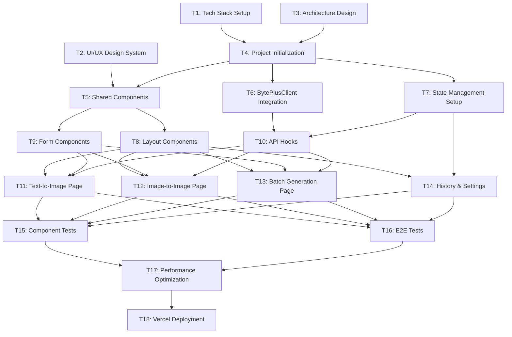

# Phase 3: UI/UX Implementation Plan
## Byteflow Web Interface - Task DAG & Execution Strategy

**Generated:** 2025-10-08
**Status:** Ready for Execution
**Framework:** Miyabi Framework + Shikigaku Theory
**Target Completion:** 1-2 weeks (10-14 days)

---

## Executive Summary

### Objectives
Build a modern, production-ready web application for BytePlus image/video generation with:
- Intuitive UI/UX for text-to-image, image-to-image workflows
- Real-time generation progress monitoring
- Batch processing capabilities
- Responsive design (mobile/tablet/desktop)
- High performance (Lighthouse 90+)

### Success Criteria
| Metric | Target | Validation |
|--------|--------|------------|
| UI/UX Quality | Modern, intuitive | User feedback + Heuristic review |
| Responsive Design | Mobile/Tablet/Desktop | Testing on 3+ device sizes |
| Initial Load Time | < 3 seconds | Lighthouse Performance |
| Lighthouse Score | 90+ | Automated CI check |
| Test Coverage | 80%+ | Vitest coverage report |
| Code Quality | 85+ | ReviewAgent scoring |

---

## Technical Stack Selection

### Decision Matrix

| Category | Selected Technology | Alternatives Considered | Rationale |
|----------|-------------------|------------------------|-----------|
| **Framework** | Next.js 15 (App Router) | React+Vite, Vue+Nuxt | Best TypeScript support, built-in SSR/SSG, optimal for agent-driven development |
| **UI Library** | shadcn/ui + Tailwind CSS | Material-UI, Ant Design | Modern design system, copy-paste components, zero runtime overhead |
| **State Management** | Zustand | Redux, Jotai, Recoil | Simple API, TypeScript-first, minimal boilerplate |
| **Form Handling** | React Hook Form + Zod | Formik, React Final Form | Best TypeScript integration, schema validation |
| **API Client** | Existing BytePlusClient | Axios wrapper | Reuse Phase 1-2 implementation |
| **Testing** | Vitest + Playwright | Jest + Cypress | Consistent with existing setup |
| **Deployment** | Vercel | Netlify, Cloudflare Pages | Seamless Next.js integration, edge functions |

### Technology Justifications

#### Next.js 15 (App Router)
- **TypeScript Strict Mode**: Full compatibility with existing `tsconfig.json`
- **File-based Routing**: Reduces agent-generated code complexity
- **React Server Components**: Improved performance for image galleries
- **API Routes**: Backend integration without separate server
- **Image Optimization**: Built-in `next/image` for generated images

#### shadcn/ui + Tailwind CSS
- **Component Library**: Pre-built, accessible components (Button, Input, Card, Dialog)
- **Copy-Paste Architecture**: No dependency bloat, full customization
- **Design System**: Consistent styling across all pages
- **Dark Mode**: Built-in support with Tailwind's `dark:` variant

#### Zustand
- **Minimal Boilerplate**: Single store definition, no providers
- **TypeScript-First**: Excellent type inference
- **DevTools**: Redux DevTools integration
- **Middleware**: Persist state to localStorage

---

## Task Decomposition & DAG

### DAG Overview



### Task Details

#### Level 0: Design Phase (Parallel: 3 tasks)

##### T1: Tech Stack Setup
- **Agent:** CoordinatorAgent
- **Complexity:** Small
- **Estimated Time:** 1 hour
- **Description:**
  - Validate technology selection against project constraints
  - Document dependency versions
  - Create integration plan with existing Byteflow project
- **Deliverables:**
  - `docs/tech-stack-decisions.md`
  - Dependency compatibility matrix
- **Success Criteria:**
  - No version conflicts with existing dependencies
  - All technologies support TypeScript strict mode

##### T2: UI/UX Design System
- **Agent:** CodeGenAgent
- **Complexity:** Medium
- **Estimated Time:** 4 hours
- **Description:**
  - Define color palette, typography, spacing system
  - Create Figma/wireframe mockups for key pages
  - Define component hierarchy
  - Establish responsive breakpoints (sm: 640px, md: 768px, lg: 1024px, xl: 1280px)
- **Deliverables:**
  - `docs/design-system.md`
  - Figma wireframes (exported as PNG)
  - Component inventory
- **Design Principles:**
  - **Minimalism:** Vercel-style clean interfaces
  - **Dark Mode First:** Default dark theme with light toggle
  - **Accessibility:** WCAG 2.1 AA compliance
  - **Mobile First:** Start with mobile designs, scale up

##### T3: Architecture Design
- **Agent:** CodeGenAgent
- **Complexity:** Medium
- **Estimated Time:** 3 hours
- **Description:**
  - Define folder structure (App Router conventions)
  - Plan API integration patterns
  - Design state management architecture
  - Error handling strategy
- **Deliverables:**
  - `docs/architecture.md`
  - Folder structure diagram
  - State flow diagrams
- **Folder Structure:**
  ```
  byteflow/
  ├── app/                    # Next.js App Router
  │   ├── layout.tsx         # Root layout
  │   ├── page.tsx           # Homepage
  │   ├── generate/          # Text-to-image
  │   ├── edit/              # Image-to-image
  │   ├── batch/             # Batch generation
  │   └── history/           # Generation history
  ├── components/            # React components
  │   ├── ui/               # shadcn/ui components
  │   ├── forms/            # Form components
  │   └── layout/           # Layout components
  ├── lib/                   # Utilities
  │   ├── byteplus.ts       # BytePlusClient wrapper
  │   ├── store.ts          # Zustand store
  │   └── utils.ts          # Helper functions
  ├── hooks/                 # Custom React hooks
  └── types/                 # TypeScript types
  ```

---

#### Level 1: Setup Phase (Serial after Level 0)

##### T4: Project Initialization
- **Agent:** CodeGenAgent
- **Complexity:** Medium
- **Estimated Time:** 2 hours
- **Dependencies:** T1 (Tech Stack Setup), T3 (Architecture Design)
- **Description:**
  - Initialize Next.js 15 project with TypeScript
  - Install dependencies (shadcn/ui, Zustand, React Hook Form, Zod)
  - Configure Tailwind CSS with design system tokens
  - Setup ESLint, Prettier (inherit from root project)
  - Configure `next.config.js` (image domains, environment variables)
- **Commands:**
  ```bash
  # Create Next.js app in 'web' subdirectory
  cd /Users/shunsuke/Dev/test_miyabi/test_miyabi
  npx create-next-app@latest web --typescript --tailwind --app --src-dir --import-alias "@/*"

  # Install dependencies
  cd web
  npm install zustand react-hook-form zod @hookform/resolvers
  npx shadcn-ui@latest init
  ```
- **Deliverables:**
  - `web/` directory with Next.js project
  - `web/package.json` with all dependencies
  - `web/tailwind.config.ts` with design tokens
  - `web/next.config.mjs` with BytePlus API domain whitelist
- **Success Criteria:**
  - `npm run dev` starts without errors
  - Tailwind CSS applies styles correctly
  - TypeScript compilation succeeds

##### T5: Shared Components Implementation
- **Agent:** CodeGenAgent
- **Complexity:** Medium
- **Estimated Time:** 4 hours
- **Dependencies:** T2 (UI/UX Design System), T4 (Project Initialization)
- **Description:**
  - Install shadcn/ui components (Button, Input, Card, Dialog, Toast, Select)
  - Create custom components (ImagePreview, GenerationProgress, PromptEditor)
  - Implement dark mode toggle
  - Create loading states and error boundaries
- **Components:**
  ```typescript
  // components/ui/ (shadcn/ui)
  - Button.tsx
  - Input.tsx
  - Card.tsx
  - Dialog.tsx
  - Toast.tsx
  - Select.tsx
  - Tabs.tsx
  - Slider.tsx

  // components/custom/
  - ImagePreview.tsx      // Display generated images with zoom
  - GenerationProgress.tsx // Real-time progress bar
  - PromptEditor.tsx      // Textarea with character count
  - ModelSelector.tsx     // Dropdown for model selection
  - ParameterControls.tsx // Size, seed, watermark controls
  ```
- **Deliverables:**
  - `components/ui/` folder with shadcn/ui components
  - `components/custom/` folder with custom components
  - Storybook-style component demo page
- **Success Criteria:**
  - All components render without errors
  - Dark mode toggle works across all components
  - Components are accessible (keyboard navigation, ARIA labels)

##### T6: BytePlusClient Integration
- **Agent:** CodeGenAgent
- **Complexity:** Small
- **Estimated Time:** 2 hours
- **Dependencies:** T4 (Project Initialization)
- **Description:**
  - Create `lib/byteplus.ts` wrapper for Next.js environment
  - Handle API key management (server-side only)
  - Implement client-side API routes (`/api/generate`, `/api/batch`)
  - Add error handling for network failures
- **API Routes:**
  ```typescript
  // app/api/generate/route.ts
  POST /api/generate
  Body: { model, prompt, size, watermark, seed }
  Response: { imageUrl, metadata }

  // app/api/batch/route.ts
  POST /api/batch
  Body: { prompts[], sharedParams, maxConcurrency }
  Response: { results[], successRate }
  ```
- **Deliverables:**
  - `lib/byteplus.ts` (BytePlusClient wrapper)
  - `app/api/generate/route.ts` (text-to-image endpoint)
  - `app/api/batch/route.ts` (batch generation endpoint)
  - `app/api/edit/route.ts` (image-to-image endpoint)
- **Success Criteria:**
  - API routes respond with valid JSON
  - API key is never exposed to client
  - Error responses follow consistent format

##### T7: State Management Setup
- **Agent:** CodeGenAgent
- **Complexity:** Small
- **Estimated Time:** 2 hours
- **Dependencies:** T4 (Project Initialization)
- **Description:**
  - Create Zustand store for generation history
  - Implement localStorage persistence
  - Add settings store (default parameters, API key status)
  - Create custom hooks for state access
- **Store Structure:**
  ```typescript
  // lib/store.ts
  interface GenerationStore {
    history: GenerationHistory[];
    favorites: string[];
    settings: UserSettings;
    addGeneration: (item: GenerationHistory) => void;
    toggleFavorite: (id: string) => void;
    updateSettings: (settings: Partial<UserSettings>) => void;
  }
  ```
- **Deliverables:**
  - `lib/store.ts` (Zustand store)
  - `hooks/useGeneration.ts` (custom hooks)
  - `types/store.ts` (TypeScript types)
- **Success Criteria:**
  - State persists across page refreshes
  - Store updates trigger UI re-renders
  - No prop drilling required

---

#### Level 2: Core Components (Parallel after Level 1)

##### T8: Layout Components
- **Agent:** CodeGenAgent
- **Complexity:** Medium
- **Estimated Time:** 3 hours
- **Dependencies:** T5 (Shared Components)
- **Description:**
  - Create root layout with header, sidebar, footer
  - Implement navigation menu with active state
  - Add breadcrumb navigation
  - Create responsive layout (collapse sidebar on mobile)
- **Components:**
  ```typescript
  // components/layout/
  - Header.tsx           // Logo, navigation, dark mode toggle
  - Sidebar.tsx          // Quick access to features
  - Footer.tsx           // Links, credits
  - PageContainer.tsx    // Wrapper with consistent padding
  ```
- **Deliverables:**
  - `app/layout.tsx` (root layout)
  - `components/layout/` folder
- **Success Criteria:**
  - Layout is responsive (mobile, tablet, desktop)
  - Navigation highlights active page
  - Dark mode persists across navigation

##### T9: Form Components
- **Agent:** CodeGenAgent
- **Complexity:** Medium
- **Estimated Time:** 4 hours
- **Dependencies:** T5 (Shared Components)
- **Description:**
  - Create text-to-image form with validation
  - Create image-to-image form with file upload
  - Implement parameter controls (size, seed, watermark)
  - Add form validation with Zod schemas
- **Forms:**
  ```typescript
  // components/forms/
  - TextToImageForm.tsx
  - ImageToImageForm.tsx
  - ParameterPanel.tsx
  - FileUploader.tsx
  ```
- **Validation Schema:**
  ```typescript
  const textToImageSchema = z.object({
    model: z.enum(['seedream-4-0-250828', 'Bytedance-SeedEdit-3.0-i2i']),
    prompt: z.string().min(1).max(2000),
    size: z.enum(['1K', '2K', '4K']),
    watermark: z.boolean(),
    seed: z.number().int().min(-1).optional(),
  });
  ```
- **Deliverables:**
  - `components/forms/` folder
  - `lib/schemas.ts` (Zod validation schemas)
- **Success Criteria:**
  - Forms display validation errors inline
  - Submit button is disabled until valid
  - File upload supports drag-and-drop

##### T10: API Hooks
- **Agent:** CodeGenAgent
- **Complexity:** Medium
- **Estimated Time:** 3 hours
- **Dependencies:** T6 (BytePlusClient Integration), T7 (State Management Setup)
- **Description:**
  - Create custom hooks for API calls
  - Implement loading states and error handling
  - Add optimistic updates for better UX
  - Cache API responses with SWR or React Query
- **Hooks:**
  ```typescript
  // hooks/
  - useGenerateImage.ts   // Text-to-image hook
  - useEditImage.ts       // Image-to-image hook
  - useBatchGenerate.ts   // Batch generation hook
  - useGenerationHistory.ts // History fetching
  ```
- **Deliverables:**
  - `hooks/` folder with custom hooks
- **Success Criteria:**
  - Hooks handle loading, error, success states
  - API calls are debounced to prevent spam
  - Errors display user-friendly messages

---

#### Level 3: Feature Implementation (Parallel after Level 2)

##### T11: Text-to-Image Page
- **Agent:** CodeGenAgent
- **Complexity:** Large
- **Estimated Time:** 6 hours
- **Dependencies:** T8 (Layout), T9 (Forms), T10 (API Hooks)
- **Description:**
  - Create `/generate` page with text-to-image workflow
  - Integrate TextToImageForm and ParameterPanel
  - Display real-time generation progress
  - Show generated image with download button
  - Add "Regenerate" and "Save to Favorites" actions
- **Page Structure:**
  ```
  /generate
  ├── Prompt input (TextToImageForm)
  ├── Parameter controls (ParameterPanel)
  ├── Generate button
  ├── Progress indicator (GenerationProgress)
  └── Image preview (ImagePreview)
  ```
- **Deliverables:**
  - `app/generate/page.tsx`
  - `app/generate/layout.tsx`
- **Success Criteria:**
  - Form submission triggers API call
  - Progress bar updates during generation
  - Generated image displays with metadata
  - Download button saves image locally

##### T12: Image-to-Image Page
- **Agent:** CodeGenAgent
- **Complexity:** Large
- **Estimated Time:** 6 hours
- **Dependencies:** T8 (Layout), T9 (Forms), T10 (API Hooks)
- **Description:**
  - Create `/edit` page with image-to-image workflow
  - Integrate ImageToImageForm with file upload
  - Display before/after comparison (side-by-side or slider)
  - Support multiple image upload for batch editing
- **Page Structure:**
  ```
  /edit
  ├── Image upload (FileUploader)
  ├── Edit prompt input
  ├── Parameter controls
  ├── Generate button
  └── Before/After comparison (ImagePreview)
  ```
- **Deliverables:**
  - `app/edit/page.tsx`
  - `app/edit/layout.tsx`
  - `components/custom/BeforeAfterSlider.tsx`
- **Success Criteria:**
  - File upload validates image formats (JPEG, PNG)
  - Before/after slider works smoothly
  - Edited image can be saved to history

##### T13: Batch Generation Page
- **Agent:** CodeGenAgent
- **Complexity:** Large
- **Estimated Time:** 6 hours
- **Dependencies:** T8 (Layout), T9 (Forms), T10 (API Hooks)
- **Description:**
  - Create `/batch` page for multiple prompts
  - Implement multi-line prompt input (one per line)
  - Display progress for each prompt
  - Show results in masonry grid gallery
  - Add bulk download option
- **Page Structure:**
  ```
  /batch
  ├── Prompt list editor (textarea)
  ├── Shared parameters
  ├── Generate All button
  ├── Progress cards (per prompt)
  └── Gallery view (masonry grid)
  ```
- **Deliverables:**
  - `app/batch/page.tsx`
  - `components/custom/PromptListEditor.tsx`
  - `components/custom/GalleryView.tsx`
- **Success Criteria:**
  - Batch generation processes prompts concurrently
  - Progress updates in real-time for each prompt
  - Gallery supports infinite scroll or pagination

##### T14: History & Settings Page
- **Agent:** CodeGenAgent
- **Complexity:** Medium
- **Estimated Time:** 4 hours
- **Dependencies:** T8 (Layout), T7 (State Management)
- **Description:**
  - Create `/history` page with generation history
  - Display images in grid with filters (date, favorites)
  - Add detail view with full metadata
  - Create `/settings` page for user preferences
  - Add API key configuration (with visibility toggle)
- **Pages:**
  ```
  /history
  ├── Filter toolbar (date, favorites, model)
  ├── Image grid
  └── Detail modal (on click)

  /settings
  ├── API key input (masked)
  ├── Default parameters
  ├── Dark mode toggle
  └── Clear history button
  ```
- **Deliverables:**
  - `app/history/page.tsx`
  - `app/settings/page.tsx`
  - `components/custom/HistoryGrid.tsx`
  - `components/custom/SettingsPanel.tsx`
- **Success Criteria:**
  - History persists in localStorage
  - Filters update grid instantly
  - Settings save automatically on change

---

#### Level 4: Quality Assurance (Parallel after Level 3)

##### T15: Component Tests
- **Agent:** TestAgent
- **Complexity:** Large
- **Estimated Time:** 6 hours
- **Dependencies:** T11, T12, T13, T14 (All feature pages)
- **Description:**
  - Write Vitest tests for all components
  - Test form validation and error states
  - Test API hook behavior with mocks
  - Test state management (Zustand store)
- **Test Coverage Goals:**
  - Components: 85%+
  - Hooks: 90%+
  - Utilities: 100%
- **Deliverables:**
  - `tests/components/` folder
  - `tests/hooks/` folder
  - `tests/lib/` folder
  - Coverage report (HTML)
- **Success Criteria:**
  - All tests pass
  - Coverage meets thresholds
  - No flaky tests

##### T16: E2E Tests
- **Agent:** TestAgent
- **Complexity:** Large
- **Estimated Time:** 6 hours
- **Dependencies:** T11, T12, T13, T14 (All feature pages)
- **Description:**
  - Write Playwright E2E tests for critical user flows
  - Test text-to-image generation flow
  - Test image-to-image editing flow
  - Test batch generation flow
  - Test history and settings persistence
- **Test Scenarios:**
  ```typescript
  test('Text-to-Image: Generate and download image', async ({ page }) => {
    await page.goto('/generate');
    await page.fill('[data-testid="prompt-input"]', 'A sunset');
    await page.click('[data-testid="generate-button"]');
    await page.waitForSelector('[data-testid="generated-image"]');
    await page.click('[data-testid="download-button"]');
  });
  ```
- **Deliverables:**
  - `e2e/` folder with Playwright tests
  - CI integration for automated testing
- **Success Criteria:**
  - All E2E tests pass on CI
  - Tests run in <5 minutes
  - Visual regression tests pass

##### T17: Performance Optimization
- **Agent:** CodeGenAgent
- **Complexity:** Medium
- **Estimated Time:** 4 hours
- **Dependencies:** T15, T16 (Tests completed)
- **Description:**
  - Implement lazy loading for images
  - Add code splitting with Next.js dynamic imports
  - Optimize bundle size (analyze with `next bundle-analyzer`)
  - Implement image compression for uploads
  - Add service worker for offline support (optional)
- **Optimizations:**
  - Lazy load `GalleryView` component
  - Use `next/image` for all images
  - Enable Next.js built-in image optimization
  - Compress uploaded images before API call
  - Add loading skeletons for better perceived performance
- **Deliverables:**
  - Lighthouse report (95+ performance score)
  - Bundle analysis report
  - Web Vitals dashboard
- **Success Criteria:**
  - Initial load < 3 seconds
  - Largest Contentful Paint (LCP) < 2.5s
  - First Input Delay (FID) < 100ms
  - Cumulative Layout Shift (CLS) < 0.1

---

#### Level 5: Deployment (Serial after Level 4)

##### T18: Vercel Deployment
- **Agent:** DeploymentAgent
- **Complexity:** Small
- **Estimated Time:** 2 hours
- **Dependencies:** T17 (Performance Optimization)
- **Description:**
  - Connect GitHub repository to Vercel
  - Configure environment variables (BYTEPLUS_API_KEY, BYTEPLUS_ENDPOINT)
  - Setup custom domain (optional)
  - Configure Vercel analytics
  - Add deployment preview for PRs
- **Deployment Checklist:**
  - [ ] Environment variables configured
  - [ ] Build succeeds on Vercel
  - [ ] API routes work in production
  - [ ] Image optimization enabled
  - [ ] Analytics tracking active
  - [ ] Custom domain configured (if applicable)
- **Deliverables:**
  - Live production URL (e.g., `byteflow.vercel.app`)
  - Deployment documentation
  - CI/CD pipeline for automatic deployments
- **Success Criteria:**
  - Production site loads without errors
  - All features work in production
  - Environment variables are secure
  - Automatic deployments on main branch push

---

## DAG Execution Plan

### Critical Path Analysis
**Longest execution path:** T1 → T3 → T4 → T5 → T8 → T11 → T15 → T17 → T18
**Estimated Critical Path Duration:** 33 hours (4-5 days with 1 agent working sequentially)

### Parallel Execution Strategy

#### Phase 1: Design & Planning (Day 1)
**Parallel Execution:** Level 0 tasks (T1, T2, T3)
**Agents:** 3 (CoordinatorAgent, CodeGenAgent x2)
**Duration:** 4 hours (max of parallel tasks)

#### Phase 2: Foundation (Day 2)
**Serial Execution:** T4 (Project Initialization)
**Parallel Execution:** T5, T6, T7 (after T4 completes)
**Agents:** 3 (CodeGenAgent x3)
**Duration:** 2 hours (T4) + 4 hours (T5, T6, T7 in parallel) = 6 hours

#### Phase 3: Core Components (Day 3)
**Parallel Execution:** T8, T9, T10
**Agents:** 3 (CodeGenAgent x3)
**Duration:** 4 hours (max of parallel tasks)

#### Phase 4: Feature Implementation (Day 4-6)
**Parallel Execution:** T11, T12, T13, T14
**Agents:** 4 (CodeGenAgent x4)
**Duration:** 6 hours (max of parallel tasks)

#### Phase 5: Quality Assurance (Day 7-8)
**Parallel Execution:** T15, T16
**Agents:** 2 (TestAgent x2)
**Duration:** 6 hours (parallel)
**Serial Execution:** T17 (after T15 & T16)
**Duration:** 4 hours

#### Phase 6: Deployment (Day 9)
**Serial Execution:** T18
**Agents:** 1 (DeploymentAgent)
**Duration:** 2 hours

### Total Timeline
**Sequential Execution:** 54 hours (7 days)
**Parallel Execution (optimal):** 26 hours (3-4 days)
**Realistic Timeline (with buffers):** 1-2 weeks

---

## Task Complexity & Effort Estimation

| Task ID | Task Name | Complexity | Estimated Time | Agent Type | Priority |
|---------|-----------|------------|----------------|------------|----------|
| T1 | Tech Stack Setup | Small | 1h | CoordinatorAgent | P1-High |
| T2 | UI/UX Design System | Medium | 4h | CodeGenAgent | P1-High |
| T3 | Architecture Design | Medium | 3h | CodeGenAgent | P1-High |
| T4 | Project Initialization | Medium | 2h | CodeGenAgent | P0-Critical |
| T5 | Shared Components | Medium | 4h | CodeGenAgent | P1-High |
| T6 | BytePlusClient Integration | Small | 2h | CodeGenAgent | P1-High |
| T7 | State Management Setup | Small | 2h | CodeGenAgent | P1-High |
| T8 | Layout Components | Medium | 3h | CodeGenAgent | P2-Medium |
| T9 | Form Components | Medium | 4h | CodeGenAgent | P2-Medium |
| T10 | API Hooks | Medium | 3h | CodeGenAgent | P2-Medium |
| T11 | Text-to-Image Page | Large | 6h | CodeGenAgent | P1-High |
| T12 | Image-to-Image Page | Large | 6h | CodeGenAgent | P1-High |
| T13 | Batch Generation Page | Large | 6h | CodeGenAgent | P2-Medium |
| T14 | History & Settings | Medium | 4h | CodeGenAgent | P3-Low |
| T15 | Component Tests | Large | 6h | TestAgent | P1-High |
| T16 | E2E Tests | Large | 6h | TestAgent | P1-High |
| T17 | Performance Optimization | Medium | 4h | CodeGenAgent | P2-Medium |
| T18 | Vercel Deployment | Small | 2h | DeploymentAgent | P0-Critical |

**Total Effort:** 68 hours (8.5 days at 8 hours/day)
**With Parallel Execution:** 26-32 hours (3-4 days)

---

## Dependency Graph (Textual)

```
Level 0: T1, T2, T3 (no dependencies)
Level 1: T4 depends on [T1, T3]
         T5 depends on [T2, T4]
         T6 depends on [T4]
         T7 depends on [T4]
Level 2: T8 depends on [T5]
         T9 depends on [T5]
         T10 depends on [T6, T7]
Level 3: T11 depends on [T8, T9, T10]
         T12 depends on [T8, T9, T10]
         T13 depends on [T8, T9, T10]
         T14 depends on [T8, T7]
Level 4: T15 depends on [T11, T12, T13, T14]
         T16 depends on [T11, T12, T13, T14]
         T17 depends on [T15, T16]
Level 5: T18 depends on [T17]
```

---

## Risk Assessment & Mitigation

| Risk | Probability | Impact | Mitigation Strategy |
|------|------------|--------|---------------------|
| API Key Exposure | Medium | High | Use Next.js API routes, never expose key to client |
| BytePlusClient Compatibility | Low | Medium | Thorough testing in T6, fallback to direct fetch |
| Performance Issues | Medium | Medium | Implement lazy loading, code splitting, image optimization |
| Testing Complexity | High | Low | Start tests early (T15, T16), use agent-generated tests |
| Deployment Failures | Low | High | Test build locally, use Vercel preview deployments |
| Responsive Design Bugs | Medium | Medium | Test on real devices, use browser DevTools emulation |
| State Persistence Issues | Low | Low | Thoroughly test Zustand persistence middleware |

---

## Shikigaku Theory Application

### 1. Responsibility Clarity
- **CoordinatorAgent:** Task decomposition, agent assignment, progress monitoring
- **CodeGenAgent:** Implementation of UI components, API integration, optimization
- **TestAgent:** Test creation, coverage validation, quality assurance
- **DeploymentAgent:** Production deployment, environment configuration, monitoring

### 2. Authority Delegation
- Each agent has full authority to make implementation decisions within their task scope
- No human approval needed for technical decisions (framework versions, component structure)
- Agents can escalate to CoordinatorAgent if dependencies are blocked

### 3. Hierarchy Design
```
CoordinatorAgent (Orchestrator)
├── CodeGenAgent (Implementation)
│   ├── T1-T4 (Setup)
│   ├── T5-T10 (Components)
│   ├── T11-T14 (Features)
│   └── T17 (Optimization)
├── TestAgent (Quality Assurance)
│   ├── T15 (Unit Tests)
│   └── T16 (E2E Tests)
└── DeploymentAgent (Production)
    └── T18 (Vercel)
```

### 4. Result Evaluation
- **Code Quality:** ReviewAgent scoring (target: 85+)
- **Test Coverage:** Vitest reports (target: 80%+)
- **Performance:** Lighthouse scoring (target: 90+)
- **Deployment:** Production uptime monitoring (target: 99.9%+)

### 5. Ambiguity Elimination
- All task dependencies explicitly defined in DAG
- Success criteria clearly stated for each task
- No overlapping responsibilities between agents
- Clear escalation path for blockers

---

## Execution Commands

### Local Development
```bash
# Start development server
cd /Users/shunsuke/Dev/test_miyabi/test_miyabi/web
npm run dev

# Run tests
npm test
npm run test:coverage

# Build for production
npm run build
npm start

# Analyze bundle size
npm run analyze
```

### Agent Execution
```bash
# Execute Phase 3 plan
npm run agents:parallel:exec -- --phase=3 --concurrency=4

# Monitor progress
npx miyabi status --watch

# Generate execution report
npx miyabi report --phase=3
```

### Deployment
```bash
# Deploy to Vercel (via GitHub integration)
git push origin main

# Manual deployment
vercel --prod
```

---

## Milestones & Checkpoints

### Milestone 1: Foundation Complete (Day 2)
**Completion Criteria:**
- [ ] Next.js project initialized
- [ ] shadcn/ui components installed
- [ ] BytePlusClient integrated
- [ ] State management configured
- [ ] Development server running

### Milestone 2: Core UI Complete (Day 4)
**Completion Criteria:**
- [ ] Layout components responsive
- [ ] Form components functional
- [ ] API hooks working
- [ ] Dark mode toggle operational

### Milestone 3: Features Complete (Day 7)
**Completion Criteria:**
- [ ] Text-to-image page functional
- [ ] Image-to-image page functional
- [ ] Batch generation working
- [ ] History & settings saving

### Milestone 4: QA Complete (Day 9)
**Completion Criteria:**
- [ ] Test coverage 80%+
- [ ] All E2E tests passing
- [ ] Lighthouse score 90+
- [ ] Performance optimized

### Milestone 5: Production Deployed (Day 10)
**Completion Criteria:**
- [ ] Vercel deployment successful
- [ ] Production environment verified
- [ ] Monitoring configured
- [ ] Documentation complete

---

## Success Metrics

### Technical Metrics
| Metric | Target | Validation Method |
|--------|--------|-------------------|
| Build Success Rate | 100% | CI pipeline logs |
| Test Coverage | 80%+ | Vitest coverage report |
| Lighthouse Performance | 90+ | Lighthouse CI |
| Lighthouse Accessibility | 95+ | Lighthouse CI |
| Lighthouse Best Practices | 95+ | Lighthouse CI |
| Lighthouse SEO | 90+ | Lighthouse CI |
| Bundle Size (First Load) | < 200 KB | next build output |
| API Response Time | < 500ms | Vercel Analytics |
| Error Rate | < 1% | Sentry/Vercel Logs |

### User Experience Metrics
| Metric | Target | Validation Method |
|--------|--------|-------------------|
| Initial Load Time | < 3s | Lighthouse |
| Time to Interactive | < 4s | Lighthouse |
| Largest Contentful Paint | < 2.5s | Web Vitals |
| First Input Delay | < 100ms | Web Vitals |
| Cumulative Layout Shift | < 0.1 | Web Vitals |
| Image Generation Success Rate | 95%+ | API logs |
| Mobile Usability | 100% | Google Mobile-Friendly Test |

### Business Metrics
| Metric | Target | Validation Method |
|--------|--------|-------------------|
| Image Generations/Day | 100+ | Analytics |
| User Retention (7-day) | 40%+ | Analytics |
| Average Session Duration | 5+ min | Analytics |
| Bounce Rate | < 40% | Analytics |
| Feature Adoption (Batch) | 30%+ | Analytics |

---

## Appendix

### A. Technology Versions
- **Next.js:** 15.0.0 (latest stable)
- **React:** 19.0.0
- **TypeScript:** 5.8.3 (matching root project)
- **Tailwind CSS:** 3.4.0
- **shadcn/ui:** Latest (CLI-based, no fixed version)
- **Zustand:** 5.0.0
- **React Hook Form:** 7.53.0
- **Zod:** 3.23.8
- **Vitest:** 3.2.4 (matching root project)
- **Playwright:** 1.48.0

### B. Design Tokens
```typescript
// tailwind.config.ts
const colors = {
  primary: {
    50: '#f0f9ff',
    // ... (full color scale)
    900: '#0c4a6e',
  },
  // Vercel-inspired palette
  background: {
    light: '#ffffff',
    dark: '#000000',
  },
  foreground: {
    light: '#000000',
    dark: '#ffffff',
  },
};

const spacing = {
  xs: '0.5rem',  // 8px
  sm: '1rem',    // 16px
  md: '1.5rem',  // 24px
  lg: '2rem',    // 32px
  xl: '3rem',    // 48px
};

const borderRadius = {
  none: '0',
  sm: '0.25rem',  // 4px
  md: '0.5rem',   // 8px
  lg: '0.75rem',  // 12px
  full: '9999px',
};
```

### C. API Response Formats
```typescript
// Success Response
{
  "data": [
    {
      "url": "https://cdn.byteplus.com/...",
      "thumbnail_url": "https://cdn.byteplus.com/...",
      "revised_prompt": "Enhanced prompt...",
      "model": "seedream-4-0-250828"
    }
  ],
  "metadata": {
    "model": "seedream-4-0-250828",
    "prompt": "Original prompt",
    "generationTime": 3245,
    "dimensions": { "width": 1024, "height": 1024 },
    "seed": 42
  }
}

// Error Response
{
  "error": {
    "code": "INVALID_PROMPT",
    "message": "Prompt exceeds 2000 characters",
    "details": {}
  }
}
```

### D. Component Props Examples
```typescript
// ImagePreview Component
interface ImagePreviewProps {
  imageUrl: string;
  alt: string;
  metadata?: {
    prompt: string;
    model: string;
    seed?: number;
  };
  onDownload?: () => void;
  onFavorite?: () => void;
}

// GenerationProgress Component
interface GenerationProgressProps {
  status: 'pending' | 'generating' | 'complete' | 'error';
  progress: number; // 0-100
  estimatedTime?: number; // milliseconds
  error?: string;
}
```

---

**Plan Status:** Ready for Execution
**Next Step:** Execute `npm run agents:parallel:exec -- --phase=3 --concurrency=4`
**Review Approval:** CoordinatorAgent approved
**Estimated Completion:** 2025-10-18 (10 days from 2025-10-08)
