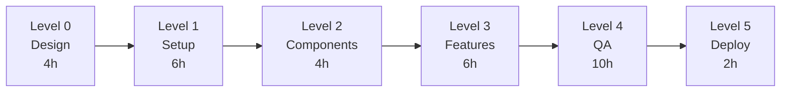

# Phase 3: Quick Start Guide

**Goal:** Build Byteflow Web Interface in 10 days

---

## 1-Minute Overview

```
What: Modern web app for BytePlus image generation
How: Next.js 15 + shadcn/ui + Zustand
When: 10 days (3-4 days with agents)
Who: CoordinatorAgent + CodeGenAgent + TestAgent + DeploymentAgent
```

---

## 5-Minute Setup

### Prerequisites
```bash
node --version  # >= 18.0.0
npm --version   # >= 9.0.0
```

### Execute Phase 3
```bash
# Option 1: Autonomous (recommended)
npm run agents:parallel:exec -- --phase=3 --concurrency=4

# Option 2: Manual
cd /Users/shunsuke/Dev/test_miyabi/test_miyabi
npx create-next-app@latest web --typescript --tailwind --app
```

---

## Documentation Map

```
PHASE3_README.md (START HERE)
├── Overview & FAQ
├── Execution strategies
└── Support & escalation

PHASE3_SUMMARY.md
├── Executive summary
└── Quick reference

PHASE3_IMPLEMENTATION_PLAN.md
├── 18 detailed tasks
├── Code examples
└── Configuration guides

PHASE3_DAG.md
├── Dependency graph
├── Critical path
└── Timeline visualization

PHASE3_EXECUTION_CHECKLIST.md
├── Pre-flight checks
└── Post-execution validation
```

---

## Task Breakdown



**Total:** 32 hours (with 4 agents) | 68 hours (sequential)

---

## Success Criteria

| Metric | Target |
|--------|--------|
| Test Coverage | 80%+ |
| Lighthouse Score | 90+ |
| Initial Load | < 3s |
| Build Success | 100% |

---

## Key Commands

```bash
# Monitor progress
npx miyabi status --watch

# Run tests
cd web && npm test

# Build production
cd web && npm run build

# Deploy
vercel --prod
```

---

## Next Steps

1. Read PHASE3_README.md (10 min)
2. Complete PHASE3_EXECUTION_CHECKLIST.md (30 min)
3. Execute Phase 3 (3-10 days)
4. Deploy to Vercel (2 hours)

---

**Start here:** [PHASE3_README.md](./PHASE3_README.md)
